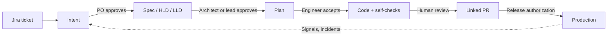

# AI-Native SDLC: Executive One-Pager

Draft · 2026-09-16 · Shared version: https://claude.ai/code/artifact/551bb74f-fddb-4627-9d1b-b5f575f660c2

## Executive Summary

**Giving engineers Claude Code is necessary, but it won't produce organization-wide gains on its own.** Individual engineers write code faster. The organization doesn't ship faster, because work still waits on:

- unclear requirements
- handoffs
- policy issues found late
- review queues
- rework

Each engineer also uses AI differently, so the gains don't add up across teams or repeat from one project to the next.

**The move to pods and homebases raises the stakes.** Pods form, deliver and disband quickly. Knowledge that lives only in people's heads leaves with them. Homebases then inherit code they didn't write and must run it indefinitely. Without shared practices, faster pods mean a heavier run-the-engine burden later.

**To get meaningful, lasting gains, we need to change how we build software, not just which tools we use.** AI-Native SDLC is a shared set of execution practices, artifacts and guardrails that lets:

- any pod build quickly with AI agents
- any homebase confidently run what pods leave behind
- quality and regulatory controls stay intact as we scale across hundreds of engineers

**Goal:** shorter idea-to-production lead time with no loss of quality, measured against baselines taken at the pilot.

**Approach:** three phases. Phase 1 builds the foundations we can deliver ourselves today. Phases 2 and 3 add central enforcement and automation with our platform partners.

## What AI-Native SDLC is, and is not

**Definition:** AI-Native SDLC is a delivery system built on four rules:

- Every meaningful change can be traced from a stated intent, through a reviewed design, to the code that shipped.
- AI agents do most of the work between human decisions.
- Our standards are written as executable skills, hooks and checks. They apply while the work is done, not weeks later in review.
- People stay accountable at defined approval gates.

| AI-Native SDLC **is** | AI-Native SDLC **is not** |
| --- | --- |
| A traceable chain: intent → spec/design → plan → PR → release, all linked to a Jira ticket | A mandate to adopt one spec-driven framework (LID, BMAD and OpenSpec all qualify) |
| Policy applied while work is created: security, compliance and architecture standards encoded as skills and checks | Merging AI-generated code that no person has reviewed, or weakening separation of duties |
| Humans deciding what to build, how to build it, whether it works, and when to ship | "Use Claude more" or a tool rollout on its own |
| Agents checking their own work (tests, lint, builds) before a person reviews it | Measuring people by lines of code or AI usage |
| Context (repo knowledge, org standards) kept as versioned, owned assets | Prompts and tribal knowledge stuck in individual chat histories |
| A loop in which production signals feed back as new intents | A one-time process redesign, or a replacement for our control framework |

## Standard everywhere vs. decided locally

The org standardizes *what* must exist and be linked. Teams decide *how* they produce it.

| Org standard (same in every repo) | Local choice (team or homebase decides) |
| --- | --- |
| Artifact types: intent, spec, HLD/LLD, plan | Which SDD framework and tooling produces them |
| Linkage contract: PRs and commits reference a Jira key and their artifacts | Where artifacts sit in the repo, file names, extra sections |
| Change tiers: which PRs need which artifacts | Extra risk paths and stricter tiers for the repo |
| Required template sections for regulated concerns (data classification, controls, rollback) | Everything else in the templates |
| Human approval gates and separation of duties | Review rotations and working agreements |
| Org context and policy skills (security, compliance, architecture) | Repo and domain context (`CLAUDE.md`, runbooks, conventions) |
| One shared check script used everywhere | Extra local hooks and checks |

Jira remains the system of record for work. GitHub is the source of truth for artifacts, so agents can read them.

## How it works

Each stage produces a versioned artifact that the next stage reads, and a named person approves it before work moves on.

The gates and the dashed feedback loop are what make this AI-native: agents do the work between gates.

Four building blocks make the chain work:

1. **Artifact contract.** Every PR and commit carries a Jira key and links to its intent and spec. The rule is framework-agnostic.
2. **Policy as code.** Skills bring org standards into every agent session. Hooks and a shared check script block or flag non-compliant actions.
3. **Layered context.** Standards are stored once and reused in every repo. Knowledge lives at four levels: org, domain/homebase, repo and directory.
4. **Humans at gates.** Agents never approve their own work. Every change goes through a PR, and production needs named authorization.

## Pods and homebases: run-the-engine must get easier

Pods are temporary teams that move fast. Homebases own the code afterward. The risk is that pods leave behind code the homebase can't operate. Our rule: a pod's work is not done until the homebase can run it with agent help.

- **Knowledge stays with the code.** Intent, spec and design are stored next to the code and linked from every PR. A homebase engineer, or their agent, can see why any line exists.
- **A handoff package is required when a pod winds down.** It covers what changed and why, updated `CLAUDE.md` and runbooks, known risks and open work in Jira. The homebase owner accepts it.
- **Homebases own their context.** Homebase-level context and skills cover services, on-call and dependencies. They persist while pods come and go.
- **Routine run-the-engine work is agent-assisted.** Examples: dependency upgrades, triage, explaining a service and runbook steps. This comes first as local skills and later as headless automation.

## Roadmap in three phases

Phase 1 is what we can build alone today. Phases 2 and 3 need the Developer Experience (DevEx) and platform teams, and we are starting that work in parallel now.

| Phase | Goal | What we deliver | Who we depend on |
| --- | --- | --- | --- |
| **1. Foundations** | Make the patterns repeatable and checkable on engineers' machines | Artifact contract and change tiers; org and repo context structure; a Foundations plugin in the skills marketplace (skills, subagents, hooks, templates); one shared check script; a local compliance audit of merged PRs; pod-to-homebase handoff | None beyond the existing marketplace and GitHub and Jira MCP servers |
| **2. Enforced and automated** | Move the same checks to where they can't be skipped, and run agents headless | The Phase 1 check script as a required GitHub check; headless AI PR review against each repo's review policy; org-managed hooks and permission tiers; sandboxes; GitHub and Jira approval checks at merge time; evals of the agent configuration; session telemetry | DevEx (Actions, sandboxes, runners), Claude platform admins (managed settings), MCP approval process |
| **3. Closed loop** | Production signals start the work automatically | Monitoring thresholds that trigger agent diagnosis and a drafted intent; scheduled security scans; incident-channel agents; automated homebase run-the-engine work (upgrades, flaky tests) | Observability, SRE, Security, DevEx |

Phase 1 is designed so that nothing is thrown away. The checks, templates and skills we build now are the ones Phase 2 runs centrally.

## How we measure success

We track speed and quality together, so a gain in one never hides a loss in the other. Baselines are taken at pilot start. Every metric can be pulled from Jira and GitHub today.

| Dimension | Metric | Source |
| --- | --- | --- |
| Speed | Lead time from Jira "ready" to production | Jira, GitHub |
| Speed | Time to first PR review; PR cycle time | GitHub |
| Quality | Change failure rate; reverts and hotfixes per release | GitHub, incidents |
| Quality | Review rework rounds per PR | GitHub |
| Traceability | Share of major PRs with linked intent and spec | Phase 1 audit |
| Run-the-engine | Homebase toil tickets, MTTR, and time for a new engineer to make a first change in a repo | Jira, incidents |
| Adoption | Repos with the Foundations plugin and a maintained `CLAUDE.md` | Phase 1 audit |

## What we need from leadership

1. **Endorse the org standards** (artifact contract, change tiers, approval gates) as the expected way of working, while keeping framework choice local.
2. **Sponsor 3–5 pilot teams** in Phase 1, mixing pods and homebases, with baselines captured at the start.
3. **Prioritize Phase 2 dependencies** with DevEx and platform owners: a required GitHub check, managed Claude hooks and settings, and write access on the existing GitHub and Jira MCP servers.
4. **Involve Risk and Compliance early** so the artifact chain and audit trail can count as control evidence, not an extra layer on top of existing controls.

## References

1. Anthropic, [The AI-Native SDLC Playbook](https://claude.com/blog/the-ai-native-sdlc-playbook). Our reference model, adapted here for a regulated enterprise and our pod and homebase operating model.
2. [AI-Native SDLC Phase 1: Foundations](02-phase-1-foundations.md). Detailed Phase 1 design.
3. [AI-Native SDLC Phase 1: Repo and Context Readiness](04-repo-and-context-readiness.md). Repo setup, multi-level context and org-wide readiness checks.
4. [AI-Native SDLC: Cross-Functional Roles, Iteration and Worked Examples](03-roles-iteration-examples.md). Product and Design roles, how changing requirements are handled, and three worked examples.
