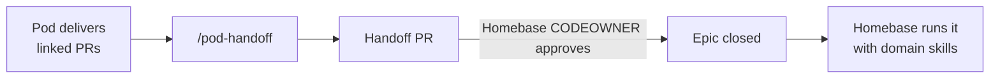

# AI-Native SDLC Phase 1: Foundations

Draft · 2026-09-16 · Shared version: https://claude.ai/code/artifact/454a4404-bd54-417b-ac99-30fba57654a4

## Scope, constraints and principles

Phase 1 delivers one installable **Foundations plugin** plus the standards it implements. Every piece runs on an engineer's machine, and the same pieces move into CI in Phase 2 without being rewritten. Companion doc: [Executive One-Pager](01-exec-one-pager.md).

**Assumed constraints**

This design assumes an environment common in large, regulated enterprises. Adjust it where yours differs.

| Constraint | What it means for Phase 1 |
| --- | --- |
| GitHub Actions are centrally controlled | No server-side required checks. Controls are local (preventive) plus an after-the-fact audit (detective). |
| Claude settings are centrally managed | Project-level `.claude/settings.json` hooks may be restricted by managed policy. Verify first (see Open questions). |
| No commit-hook framework | We ship plain git hooks and document alternatives to evaluate. |
| New MCP servers are slow to approve, but **GitHub and Jira MCP servers are already available** in Claude | Skills use the GitHub and Jira MCP servers for PRs, reviews, tickets and approvals. Scripts that run outside Claude, such as git hooks, can't use MCP, so they rely on `git` plus evidence recorded by skills (section 4.8). |
| Skills marketplace exists and is easy to publish to | The marketplace is the distribution channel for skills, subagents and hooks. |
| Jira is the system of record; artifacts may start in Google Docs | Every change carries a Jira key. Artifacts agents need must be in GitHub, because agents can't read Google Docs. |
| Teams use LID, BMAD, OpenSpec or nothing | Check that artifacts exist and are linked, never which framework made them. |

**Design principles**

1. **Write the check once, run it anywhere.** One `sdlc-check` script backs the Claude hook, the git hook, the manual skill and, later, the GitHub check.
2. **Specify the result, not the method.** We require an intent to exist with certain sections. How a team writes it is up to them.
3. **Guide first, block only when necessary.** Blocking applies only to Tier 2+ changes (defined below). Everything else gets a warning with a fix.
4. **Local controls can be skipped, so also check afterward.** `--no-verify` exists. The audit skill catches what local hooks miss.
5. **Keep context small and load it when needed.** Standards live in skills that load when relevant, not in huge `CLAUDE.md` files.
6. **Keep dependencies minimal.** Scripts need only `git` and a POSIX shell (`gh` optional), or Python standard library if it's on every developer machine.

## 1. The artifact contract

Every PR and its commits declare a Jira key, a change tier and links to the required artifacts, in a fixed machine-readable format. Artifacts may come from any framework, as long as they live in GitHub and contain the required sections.

**1.1 Linkage format.** We use the same keys in two places: git commit trailers, which stay in history for audit, and a block in the PR description generated from the PR template.

```text
Jira: PAY-1234
Change-Tier: 2
Intent: openspec/changes/add-refunds/proposal.md
Spec: openspec/changes/add-refunds/design.md
Design: docs/architecture/refunds-hld.md
Plan: openspec/changes/add-refunds/tasks.md
```

- Each value is a repo-relative path, a GitHub URL (another repo, such as a shared design repo) or a Jira key.
- `n/a: <reason>` is allowed where the tier doesn't require that artifact.
- A Google Docs URL may be listed **in addition** to a GitHub artifact, never instead of one, because agents can't read it.

**1.2 Artifacts required by tier** (tiers defined in section 2)

| Artifact | Tier 0 | Tier 1 | Tier 2 | Tier 3 |
| --- | --- | --- | --- | --- |
| Jira key | Required | Required | Required | Required |
| Intent | — | Jira ticket is enough | Required, in GitHub | Required, in GitHub |
| Spec | — | — | Required | Required |
| HLD/LLD | — | — | If architecture changes | Required |
| Plan | — | Recommended | Recommended | Required |
| Approval evidence | — | — | Intent and spec approved | Intent, spec and design approved, plus risk sign-off |

**1.3 Minimum sections.** The check looks for these headings. Team templates can add anything on top.

| Artifact | Required sections |
| --- | --- |
| Intent | Problem · Desired outcome and success measure · Users/systems affected · Constraints (including regulatory) · Out of scope · Open questions |
| Spec | Requirements · Approach · Data classification and data flows · Security and controls · Alternatives considered · Test strategy · Rollout and rollback |
| HLD/LLD | Context and boundaries · Components and interfaces · Data classification · Non-functional requirements · Failure modes · Dependencies |
| Plan | Steps · Files/components touched · Test plan · Risks |

**1.4 Framework adapters.** Each repo has `.sdlc/config.yaml`, which maps its framework's files to our artifact types. It also lists heading aliases, so a BMAD "Goals" heading counts as "Desired outcome". The org publishes starter adapters, but paths must be checked against each framework version in use.

```yaml
version: 1
jira_projects: [PAY]
artifact_root: docs/sdlc          # default location when no framework is used
adapter: openspec                 # openspec | bmad | lid | none
artifacts:
  intent: "openspec/changes/*/proposal.md"
  spec:   "openspec/changes/*/design.md"
  plan:   "openspec/changes/*/tasks.md"
section_aliases:
  intent:
    problem: ["Problem", "Why", "Background"]
    outcome: ["Desired outcome", "Goals", "What Changes"]
risk_paths:                       # feeds tier detection (section 2)
  - "src/**/auth/**"
  - "db/migrations/**"
templates_dir: .sdlc/templates    # optional local overrides
```

**1.5 Optional frontmatter.** Teams may add a small YAML header to artifacts: `type`, `jira`, `status`, `owner`, `approvers`. The check uses it when present and never requires it, because some framework generators overwrite headers.

**1.6 Approval evidence without new tooling.** An artifact counts as approved when either:

- it was merged to the default branch in a PR approved by its CODEOWNER (the product owner for intents, the architect or lead for specs), or
- its Jira ticket is in an agreed approved status.

The audit reads both.

## 2. Change tiers (what counts as a "major PR")

Proposal: a **major PR is Tier 2 or above**. A PR is Tier 2 or above if it meets any trigger below, however many lines it changes. The author declares the tier. `sdlc-check` calculates a minimum tier from the diff and warns or blocks if the declared tier is lower.

| Tier | Name | Triggers (any one) | Examples |
| --- | --- | --- | --- |
| 0 | Trivial | Only docs, comments, formatting, test-only changes, or lockfile/patch dependency bumps with no source changes | README fix, lint autofix |
| 1 | Standard | Anything else below the Tier 2 triggers | Bug fix inside one module, small UI change |
| 2 | Major | More than ~400 changed lines, excluding tests, generated code and lockfiles · New service, module or public/external API, or a breaking API change · Database schema or data model change · New external dependency or third-party integration · Infrastructure-as-code or deployment config · New customer-facing behavior, including behind a flag · Any path in the repo's `risk_paths` | New endpoint, schema migration, new vendor SDK |
| 3 | High-risk | Authentication/authorization, cryptography or secrets handling · Handling of PII, PCI or other restricted data · Money movement, ledger or regulatory reporting logic · Changes to logging or audit controls · Cross-domain architecture change | New auth flow, change to a payment posting rule |

**Notes**

- The 400-line threshold is a starting point. We'll adjust it using pilot data from the audit.
- Detection uses changed paths and simple content patterns only. It is a floor, not a classifier. Authors can raise a tier but not lower it without writing `Change-Tier-Override: <reason>`, which the audit reports.
- Repos can add their own `risk_paths` and make tiers stricter, but never looser.
- The org keeps the default Tier 3 path and pattern list in the Foundations plugin, so updating it once updates every repo.

## 3. Context management

Context is organized in five layers, each with a named owner. The org layer ships as marketplace skills plus a short always-loaded core, not as copied files. That lets every engineer get updates by upgrading the plugin instead of editing every repo.

| Layer | Contents | Where it lives | How Claude loads it | Owner |
| --- | --- | --- | --- | --- |
| Org | Non-negotiables (security, data handling, AI usage policy), artifact contract, tier rules, architecture principles, glossary | Parent `org-sdlc-context` repo, built into the Foundations plugin | Short core (about 50 lines) injected by a plugin `SessionStart` hook; detailed policy as skills loaded when relevant | Your team |
| Domain / homebase | Service catalog, domain glossary, integration map, runbooks, on-call practices, shared templates | Domain context repo, published as a `<domain>-context` plugin | Skills loaded when relevant | Homebase lead |
| Repo | Purpose, architecture map, build/test/lint commands, conventions, known pitfalls, where artifacts live | `CLAUDE.md`, `REVIEW.md`, `.sdlc/config.yaml`, `docs/adr/` | `CLAUDE.md` loaded at session start | Repo CODEOWNERS |
| Directory | Module-specific rules, such as "migrations must be backward compatible" | Nested `CLAUDE.md` (or path-scoped rules, if your Claude Code version supports them) | Loaded when Claude works in that directory | Module owner |
| Personal | Individual preferences and shortcuts | `~/.claude/CLAUDE.md` or a gitignored local file | Loaded for that user only | Engineer |

**Rules**

1. **Specific beats general for conventions.** Org non-negotiables can't be overridden. They are written as MUST rules and also enforced by `sdlc-check`, not just by prompt text.
2. **Point, don't paste.** Repo `CLAUDE.md` stays under ~150 lines and links to ADRs, specs and runbooks instead of copying them. Anything used only sometimes becomes a skill.
3. **Context is code.** `CLAUDE.md`, `REVIEW.md` and `.sdlc/` have CODEOWNERS, are reviewed like code, and are updated in the same PR that makes them wrong.
4. **Stale context is a defect.** `/context-audit` flags oversized files, dead paths and links, commands that fail, and files with no update in 180 days.
5. **No secrets or restricted data** in any context layer. The check scans context files for obvious secrets and PII patterns.

**Options for bringing parent-repo context into each repo.** These are the alternatives to evaluate; the first is recommended.

| Option | How | Pros | Cons |
| --- | --- | --- | --- |
| A. Plugin-packaged (recommended) | Parent repo builds the Foundations or domain plugin; `SessionStart` hook prints the core and skills hold the details | Versioned, one upgrade path, no files in repos, loads only when needed | Needs a plugin release for each change; confirm marketplace supports hooks in plugins |
| B. Git submodule or subtree | Add parent repo at `.sdlc/org`; `CLAUDE.md` imports `@.sdlc/org/core.md` | Pinned version, visible in the repo | Submodule friction; each of hundreds of repos must bump it |
| C. Sibling checkout plus imports | `@../org-sdlc-context/core.md` | No repo changes | Breaks if checkout layouts differ; not reproducible |
| D. Sync at session start | Hook runs `gh` to fetch the latest parent context into a local cache | Always current | Needs network and auth; changes arrive without review |
| E. Managed policy `CLAUDE.md` (Phase 2) | Central admins deploy the org core through managed settings | Can't be skipped; nothing to install | Needs platform admins; slower to change |

## 4. The Foundations plugin

Phase 1 ships as one marketplace plugin, `sdlc-foundations`. It bundles skills, subagents, Claude hooks, templates and the `sdlc-check` script, plus a bootstrap skill that sets up each repo in one command.

**4.1 Layout**

```text
sdlc-foundations/
  .claude-plugin/plugin.json
  context/org-core.md            # ~50-line org non-negotiables (SessionStart)
  skills/                        # see 4.2
  agents/                        # see 4.3
  hooks/hooks.json               # see 4.4
  bin/sdlc-check                 # one check, many callers (4.6)
  bin/tier-detect
  githooks/commit-msg, pre-push  # copied into repos by /sdlc-init
  templates/intent.md spec.md hld.md lld.md plan.md
  templates/CLAUDE.md REVIEW.md pull_request_template.md sdlc-config.yaml
  adapters/openspec.yaml bmad.yaml lid.yaml none.yaml
```

**4.2 Skills**

| Skill | Used by | What it does | Output |
| --- | --- | --- | --- |
| `/sdlc-init` | Repo owner, once | Detects the framework and picks an adapter. Writes `.sdlc/config.yaml`, a starter `CLAUDE.md` and `REVIEW.md`, the PR template and CODEOWNERS entries for context files. Copies the check script and git hooks into the repo and sets `core.hooksPath`. | PR to set up the repo |
| `/intent` | PO, engineer | Interviews the requester and drafts an intent, using the repo's framework if there is one, otherwise the org template. Reads the Jira ticket through the Jira MCP server and links the intent back to it. | Intent file on a branch |
| `/spec`, `/design-doc` | Engineer, architect | Drafts a spec or HLD/LLD from an approved intent, applying org policy skills and flagging concerns early. | Spec or HLD/LLD file |
| `/plan` | Engineer | Runs plan mode against the spec and saves the accepted plan when the tier requires one. | Plan file |
| `/pr-prepare` | Engineer | Detects the tier and checks the linked artifacts. Looks up approvals through the GitHub MCP server (CODEOWNER reviews) and the Jira MCP server (statuses), and records them as `Approval-Evidence`. Runs the self-review subagents, writes trailers and the PR body, then opens the PR through the GitHub MCP server. | Linked PR |
| `/self-review` | Engineer | Runs reviewer subagents in parallel against the diff, `REVIEW.md` and the linked spec. | Findings list, fixed before the PR |
| `/sdlc-check` | Anyone | Runs the check manually and explains each failure with a fix. | Pass, warn or block report |
| `/context-audit` | Repo and homebase owners | Checks context for staleness, size, dead links and failing commands. | Report plus a suggested PR |
| `/pod-handoff` | Pod lead | Builds the handoff package (section 6). | Handoff PR plus Jira comment |
| `/sdlc-audit` | Your team, homebase leads | Uses the GitHub MCP server to scan merged PRs across a list of repos for trailers, tiers, overrides and approvals. Checks every `Approval-Evidence` line against live GitHub reviews and Jira statuses. | Markdown or CSV compliance and adoption report |
| Policy skills: `secure-coding`, `data-classification`, `logging-and-audit`, `api-standards`, `resilience` | Loaded automatically | Encode org standards so they apply while code is written. | — |

**4.3 Subagents** (read-only tools unless noted)

| Subagent | Role |
| --- | --- |
| `spec-reviewer` | Checks intent and spec for completeness, testable requirements and missing required sections |
| `policy-reviewer` | Reviews the diff against `REVIEW.md` and org policy skills, grading severity as defined in `REVIEW.md` |
| `security-reviewer` | Checks auth, secrets, injection, restricted-data handling and logging of sensitive fields |
| `test-gap-reviewer` | Maps spec requirements to tests and reports gaps |
| `spec-conformance` | Compares what the code does with what the spec and plan said, and reports drift |
| `context-curator` | Proposes `CLAUDE.md` and runbook updates from the session's changes (can edit) |

Subagents give advice only. Human PR review stays mandatory, and no subagent's output counts as an approval.

**4.4 Claude hooks** (shipped in the plugin, running only inside Claude sessions)

| Event | Matcher | Action | Effect |
| --- | --- | --- | --- |
| `SessionStart` | — | Prints org core, detected Jira key from the branch name, and repo SDLC status (config present, check-script version) | Context |
| `PreToolUse` | `Bash` running `git commit` | `sdlc-check --staged` | Tier 2+ missing links: **block** with fix; otherwise warn |
| `PreToolUse` | `Bash` running `git push` or `gh pr create`, plus the GitHub MCP server's create-PR tool (matched by its `mcp__<server>__<tool>` name) | `sdlc-check --range origin/<default>..HEAD` | Tier 2+ missing artifacts or approvals: **block** |
| `PreToolUse` | `Bash` with `--no-verify`, force-push to the default branch, or `git config core.hooksPath` changes | Deny | Stops the agent from skipping controls |
| `PreToolUse` | `Edit`/`Write` on protected paths (`.sdlc/`, `CODEOWNERS`, `.githooks/`, migrations) | Ask the user | Human confirms |
| `PostToolUse` | `Write` on artifact paths | Lints required sections and scans for secrets or PII | Warning fed back to Claude |
| `Stop` | — | If source changed and no test command ran this session, reminds Claude to run tests | Self-verification nudge (evaluate in pilot) |

**4.5 Git hooks** (committed to `.githooks/` and run for every commit, with or without Claude)

- `commit-msg`: requires a `Jira:` key (or a branch-name key) and a `Change-Tier:` trailer. Missing trailers are added automatically from the branch when possible.
- `pre-push`: runs `sdlc-check` on the commits being pushed and blocks Tier 2+ pushes that lack artifacts.
- Both can be skipped with `--no-verify`. That is expected; the audit (section 5) catches it.

**4.6 `sdlc-check` specification**

- **Modes:** `--staged`, `--range <a>..<b>`, `--pr <number>` (reads the PR body via `gh`), `--json`.
- **Checks:** Jira key format and project allowlist · declared vs. detected tier · required artifacts exist in the repo or GitHub for the tier · required sections present (using heading aliases) · approval evidence (merged with CODEOWNER review, or Jira status) · overrides have reasons · no secrets or PII in artifacts and context files.
- **Exit codes:** `0` pass, `1` warn, `2` block. These match Claude hook semantics, and in Phase 2 a GitHub check can use the same script unchanged.
- **Implementation:** a single dependency-light file (POSIX shell plus `git`/`gh`, or Python standard library), versioned with the plugin, vendored into repos by `/sdlc-init`, and stamped with its version so the audit can find old copies.

**4.7 Templates**

Templates resolve in this order: repo `.sdlc/templates/` → domain plugin → org plugin. Teams can change anything except the required sections in 1.3, which `sdlc-check` enforces regardless of template.

**4.8 Checks that use GitHub and Jira MCP**

Checks that need GitHub or Jira data (reviews, approvals, ticket status) run inside Claude sessions through the GitHub and Jira MCP servers. Checks that need only git stay in the `sdlc-check` script, so git hooks and Phase 2 CI can still run it.

| Where it runs | Can it use MCP? | GitHub and Jira job |
| --- | --- | --- |
| Skills: `/intent`, `/pr-prepare`, `/sdlc-check`, `/amend`, `/change-impact`, `/pod-handoff`, `/intent-from-incident` | Yes | Read tickets, PRs and reviews; open PRs; request reviews; add comments; reopen Jira approval sub-tasks; create follow-up tickets; record approval evidence |
| Claude hooks | No. Hooks run shell commands and can't call MCP tools directly (confirm against the hook types in your Claude Code version). They can match MCP tool calls by name. | Before a PR is created through `gh` or the GitHub MCP server, block when a required approval has no `Approval-Evidence` line. The message tells Claude to run `/sdlc-check`. |
| `sdlc-check` script in git hooks | No | Git-only checks. Confirms an `Approval-Evidence` line exists for each required approval and names the current artifact commit. Uses `gh` for live checks only if it happens to be installed. |
| `/sdlc-audit` | Yes | Compares every `Approval-Evidence` line with live GitHub reviews and Jira statuses, and reports mismatches |
| Phase 2 CI | Through GitHub and Jira service accounts | Checks approvals at merge time, making this a control that can't be skipped |

Evidence format: one line per required approval, recorded in the PR body and commit trailers.

```text
Approval-Evidence: intent artifact=a1b2c3d source=jira ref=ORD-101 status="Intent Approved" by=<approver> at=2026-09-14
Approval-Evidence: spec artifact=d4e5f6a source=github ref=PR#482 review=approved by=<codeowner> at=2026-09-15
```

In Phase 1, an evidence line written by an agent is a claim, not proof. `/sdlc-audit` is what checks it, so approvals are a detective control until the Phase 2 CI check exists. Two things to confirm with the Claude platform admins:

- whether write tools are allowed on both servers (creating PRs, requesting reviews, commenting, Jira transitions), not just reads
- whether the audit can run under a service identity rather than a person's login

## 5. Enforcement and verification without owning CI

No single Phase 1 control is impossible to skip, so we layer controls that stop problems before they happen with an audit afterward. Together they make skipping visible and rare. The audit also produces evidence we can show risk partners.

| Layer | Type | Covers | How it can be skipped | Phase |
| --- | --- | --- | --- | --- |
| Policy skills and org core | Guidance | Claude sessions | Plugin not installed | 1 |
| Claude hooks in the plugin | Preventive | Commits and PRs made by Claude | Plugin disabled; git run outside Claude; blocked if managed settings allow only managed hooks | 1 |
| Git hooks (`core.hooksPath`) | Preventive | All local commits and pushes | `--no-verify`; repo never set up | 1 |
| PR template and CODEOWNERS on artifact and context paths | Structural | Every PR | Template deleted; code-owner review not required by branch protection | 1 |
| `/sdlc-audit` scheduled from our side | Detective | All merged PRs in enrolled repos | Can't be skipped after merge | 1 |
| Required GitHub check running `sdlc-check`; managed hooks | Preventive, central | Everything | Admin exception only | 2 |

**How the audit runs.** Your team runs `/sdlc-audit` weekly against enrolled repos, locally or as a scheduled Claude task. It reports three things per homebase:

- Tier 2+ PRs missing links or approvals
- Overrides, and commits pushed with hooks skipped (detected by missing trailers)
- Copies of `sdlc-check` that are out of date

Findings go to homebase leads as Jira tickets or a report. Nobody is blocked; the aim is to show gaps and fix patterns.

**Alternatives to investigate** for distributing hooks and enforcing rules server-side without owning Actions:

| Alternative | What it is | Why consider it | Watch-outs | Owner to ask |
| --- | --- | --- | --- | --- |
| Plain `core.hooksPath` plus committed scripts (**our default**) | `/sdlc-init` sets repo git config to `.githooks/` | No dependencies; works in any language | Each clone needs a one-time setup (the `SessionStart` hook can detect it and prompt) | None |
| [pre-commit](https://pre-commit.com) | Python hook framework with a shared hook repo | Large ecosystem; central hook repo with versions | Needs Python on every machine; supply-chain review of hook sources | Security, DevEx |
| [Lefthook](https://github.com/evilmartians/lefthook) | Single-binary hook manager configured in YAML | Fast, works in any language, supports monorepos | Binary must be installed or approved | DevEx, endpoint team |
| [Husky](https://typicode.github.io/husky/) | Node.js hook manager | Familiar in JS repos | JS/TS repos only | Team choice |
| Git `init.templateDir` or a global `core.hooksPath` | Hooks installed on every developer machine | Covers every repo without per-repo setup | A global `hooksPath` overrides repo hooks, so it must chain to them | Endpoint and device management |
| GitHub repository/org rulesets with commit metadata or branch-name restrictions | Server-side pattern rules, such as requiring `Jira: [A-Z]+-\d+` in commit messages | Server-side enforcement without Actions | Availability depends on the GitHub plan; set by org admins; checks the pattern only, not artifact content | GitHub org admins |
| Org-wide `.github` repo defaults | Default PR template for every repo | One PR template for every repo | Repos can override it; doesn't enforce anything | GitHub org admins |
| Jira–GitHub integration and Jira automation | Jira development panel shows linked PRs; automation flags tickets closed without a linked PR or intent | Uses our system of record | Detective only; needs a Jira admin | Jira admins |
| Managed Claude settings (Phase 2) | Hooks and permissions deployed centrally | Users can't disable them | Central change process | Claude platform admins |

## 6. Pods and homebase handoff

A pod may not close its Jira epic until the homebase owner approves a handoff PR produced by `/pod-handoff`. The homebase inherits context, not just code.



**Handoff package** (generated from the artifact chain and git history, then edited by the pod)

- **What shipped and why:** list of intents and specs delivered, with the PRs that implemented them.
- **Context updates:** changes to `CLAUDE.md`, nested `CLAUDE.md` files and ADRs for the new or changed components.
- **Operability:** runbook entries, dashboards and alerts, known failure modes, rollback steps and feature flags still in use.
- **Open work:** remaining work and tech debt as Jira tickets in the homebase backlog; unresolved spec questions.
- **Risks:** Tier 3 changes and their controls, exceptions granted and override reasons.

**Built for homebase run-the-engine work** (Phase 1 local skills in the domain plugin, owned by the homebase)

| Skill | Run-the-engine job it helps with |
| --- | --- |
| `/explain-service` | Onboarding and on-call: summarizes a service from `CLAUDE.md`, ADRs, specs and code |
| `/triage` | Structured first-pass diagnosis from logs or stack traces the engineer pastes, following the runbook |
| `/dependency-upgrade` | Plans and applies an upgrade with tests, producing a Tier 0 or 1 PR with the right trailers |
| `/runbook-step` | Walks through a runbook procedure with confirmation before each state-changing command |
| `/intent-from-incident` | Turns a post-incident finding into an intent. This is the manual version of the Phase 3 loop. |

Pods that use the Foundations plugin leave repos in a state these skills can use right away. That is the concrete way run-the-engine gets easier rather than harder.

## 7. Rollout, metrics and exit criteria

Roll out in four stages. Take baselines before the pilot, and only move on when the stage's exit criteria are met. Durations are placeholders to adjust to your planning cadence.

| Stage | Scope | Work | Exit criteria |
| --- | --- | --- | --- |
| 0. Build | Your team | Plugin MVP: `/sdlc-init`, `/intent`, `/spec`, `/pr-prepare`, `sdlc-check`, Claude hooks, git hooks, org core, adapters for your frameworks; verify managed-settings compatibility | Works end to end in 2 internal repos, one using OpenSpec and one using BMAD or LID |
| 1. Pilot | 3–5 teams (at least 1 pod, 1 homebase, 2 frameworks) | Set up repos; weekly audit; office hours; calibrate tiers | 80%+ of Tier 2+ PRs linked; engineers rate it net-positive; tier false-positive rate under 10% |
| 2. Expand | One domain | Domain context plugin, `/pod-handoff`, run-the-engine skills, `/context-audit` | At least 1 completed pod-to-homebase handoff; homebase lead confirms it was usable |
| 3. Scale | Opt-in across the org | Marketplace release, docs, champions network | Phase 2 dependencies agreed with DevEx and platform admins |

**Phase 1 metrics** (all from `gh` and Jira, no new telemetry)

| Metric | Source | Direction |
| --- | --- | --- |
| Tier 2+ PRs with linked intent and spec | `/sdlc-audit` | Up |
| Overrides and skipped-hook commits per repo | `/sdlc-audit` | Down |
| PR cycle time; time to first review | GitHub | Down |
| Review rounds per PR | GitHub | Down |
| Reverts and hotfixes within 14 days of merge | GitHub | Down or flat |
| Jira lead time (ready to done) | Jira | Down |
| Repos with a `CLAUDE.md` updated in the last 180 days | `/context-audit` | Up |

**Phase 1 is done when:** the plugin is in the marketplace; the artifact contract and tiers are approved by architecture and risk partners; pilots show better speed and quality metrics with no quality regression; and DevEx has a committed plan to run `sdlc-check` as a required check.

## 8. Open questions to verify

The first three can block the design and should be answered before Stage 0 build starts.

- [ ] **Claude platform admins:** Do managed settings allow hooks from project and plugin settings, or only managed hooks? Are marketplace plugins allowed to ship hooks and subagents, or only skills?
- [ ] **Claude platform admins:** Which write tools on the GitHub and Jira MCP servers are allowed (create PR, request review, comment, Jira transitions)? Phase 1 depends on them (section 4.8).
- [ ] **GitHub org admins:** Who controls branch protection? Can repo owners require CODEOWNER review, which our approval evidence depends on?
- [ ] **GitHub org admins:** Are rulesets with commit metadata or branch-name restrictions available on our plan, and would admins apply a Jira-key pattern?
- [ ] **Endpoint team:** Is Python 3 (or only POSIX shell) guaranteed on every developer machine? This decides how `sdlc-check` is implemented.
- [ ] **LID owners:** What are LID's artifact file names and headings? Needed for the LID adapter.
- [ ] **Risk and Compliance:** Does the artifact chain plus CODEOWNER approval count as change-management evidence? Which Tier 3 triggers are they missing?
- [ ] **Architecture:** Confirm the 400-line threshold and the default Tier 3 path and pattern list.
- [ ] **Jira admins:** Which workflow status counts as "intent approved"? Can an automation flag tickets closed without a linked PR?
- [ ] **DevEx:** Can the Phase 2 required check simply run `sdlc-check` unchanged? Agree on the script's interface now.
