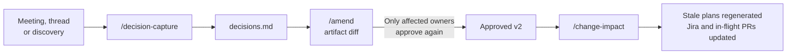
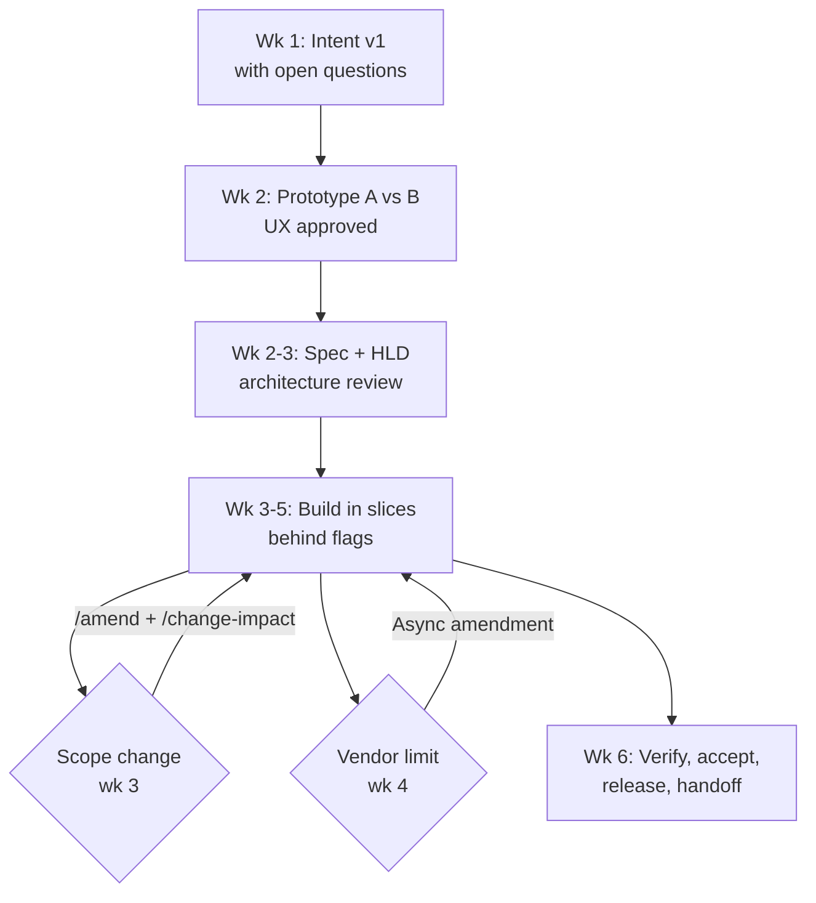
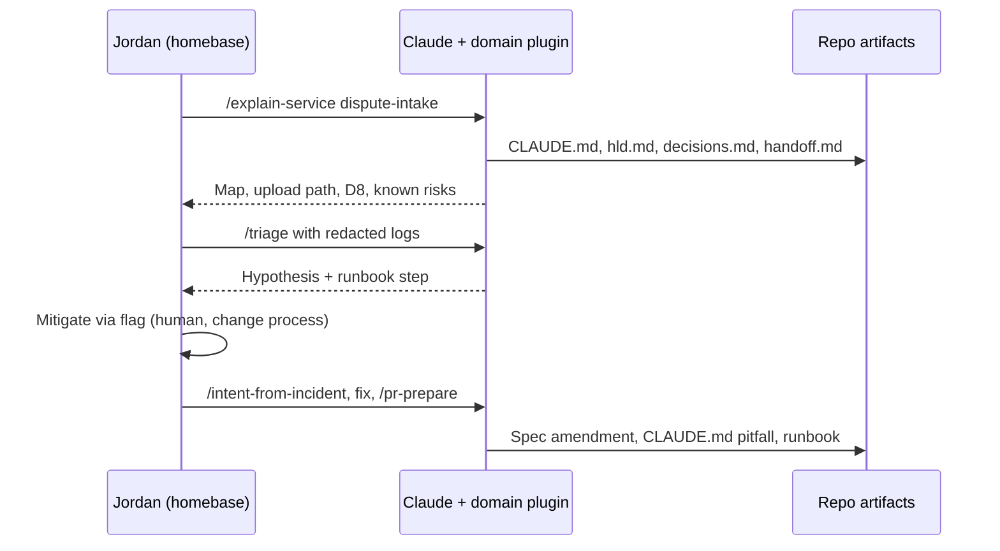

# AI-Native SDLC: Cross-Functional Roles, Iteration and Worked Examples

Draft for brainstorming · 2026-09-16 · Shared version: https://claude.ai/code/artifact/5cbd0f88-47eb-405f-a73e-31134ee97f9d

**Summary.** Product and Design use the same pattern as engineers:

- Each owns specific artifacts: Product owns the intent and acceptance criteria; Design owns a UX artifact next to the Figma file.
- Each approves those artifacts at a gate, either as CODEOWNER in GitHub or through a Jira approval status. Engineers own all verification; there is no separate QA function.
- Each uses Claude skills to write and check their artifacts.

Iteration is expected, not an exception. Every change to requirements goes through the artifact first, as a reviewed amendment. Meeting outcomes become recorded decisions. Parts that aren't settled are marked provisional, so settled slices can still ship.

This extends [Phase 1: Foundations](02-phase-1-foundations.md). All examples are illustrative.

## 1. Roles by stage

Each stage has one accountable role and one gate. Agents draft and check the work; the named role approves it.

| Stage | Product | Design | Engineering (pod) | Homebase | Risk, Security, Compliance |
| --- | --- | --- | --- | --- | --- |
| **Intent** | **Owns.** States the problem, outcome, success metric and acceptance criteria. **Approves the intent.** | Adds user research and known usability pain | Flags feasibility and size early | Flags operational impact on its services | Notified for Tier 3 |
| **Design** (spec, UX, HLD/LLD) | Approves the requirements and acceptance criteria in the spec | **Owns the UX artifact** (flows, states, copy, accessibility) and the mocks. **Approves UX.** | **Owns the spec and HLD/LLD.** Tech lead or architect approves. | Reviews operability sections | Reviews data classification, controls and regulated copy; approves Tier 3 |
| **Plan** | Agrees on slicing and what ships behind flags | Agrees on UI slice order | **Owns the plan.** The engineer accepts it. | — | — |
| **Build** | Answers questions in PR or issue threads | Answers questions; reviews in-progress screenshots | Agents build in worktrees and check their own work | — | Policy skills apply automatically |
| **Verify** | Checks acceptance criteria in the preview or staging environment | **Approves UI fidelity** from `/ux-check` screenshots | **Owns verification** (no separate QA): tests from `/acceptance` outlines, `/self-review`, `/ux-check` | — | `security-reviewer` findings resolved |
| **Review and release** | Signs off on acceptance | Signs off on UI-visible changes | Peer engineer approves the PR | — | Release follows the existing change-management process |
| **Operate** | Owns follow-up intents | Owns UX follow-ups | Pod hands off through `/pod-handoff` | **Accepts the handoff.** Owns run-the-engine work. | Incident review |

**Rule of thumb.** Product decides *what* and *whether it's acceptable*. Design decides *how it looks and feels*. Engineering decides *how it's built*. The homebase decides *whether it can be run*. Risk decides *whether it's allowed*.

## 2. How Product and Design fulfill their roles

Product and Design don't need to learn git. Claude handles branches and PRs for them. They approve either with a CODEOWNER review in the GitHub web UI or by setting a Jira status. Each team picks one (section 2.4).

**2.1 Product**

| Need | How it works |
| --- | --- |
| Write requirements | Run `/intent` in the Claude desktop app. Claude asks structured questions, reads the Jira ticket, and drafts the intent with acceptance criteria written as Given/When/Then. It opens the PR itself. |
| Already drafted in Google Docs or Jira | Paste the text, or run `/intent --from-jira CARD-123`. Claude turns it into the repo intent. The Google Doc link can stay as a supplementary link. |
| Approve | Product is CODEOWNER on intent files and on the spec's "Requirements" section, which lives in its own file (below). Approve through a GitHub PR review or a Jira approval status (section 2.4). |
| Check the result | Run `/acceptance`, which builds a checklist from the acceptance criteria. Walk it in the preview or staging environment and record pass or fail in the PR. |
| Change their mind | Run `/amend` (section 3). Never edit a Jira comment and expect engineering to notice. |

**2.2 Design**

| Need | How it works |
| --- | --- |
| Mocks | Figma stays the tool for visual work. Agents can't read Figma without an approved Figma MCP server (a Phase 2 request), so the key frames are exported as PNGs next to the UX artifact. Claude can read images. |
| UX artifact | Run `/ux-spec` to produce `ux.md`: user flows as diagrams, screen inventory, states (empty, loading, error, edge cases), copy, accessibility (WCAG 2.1 AA), design-system components and tokens used, and Figma links plus exported frames. |
| Design-system rules applied while code is written | A `design-system` policy skill tells the coding agent which components, tokens and patterns to use, so UI arrives close to the design on the first attempt. |
| Check fidelity | `/ux-check` builds the UI locally, captures screenshots of each listed state (using a local browser tool if allowed), and compares them with the exported frames using the `ux-conformance` subagent. Screenshots are attached to the PR. |
| Approve | Design is CODEOWNER on `ux.md` and on paths for shared UI components. For other UI changes, `/pr-prepare` requests Design review whenever `ux.md` is linked. Approval can be a GitHub review or a Jira status (section 2.4). |
| Explore options fast | `/prototype` builds a disposable, clickable prototype on a spike branch in hours. Use it for usability tests and to settle debates (section 3). |

**2.3 Artifact layout for a change** (default layout; framework adapters can map it to other paths)

```text
docs/sdlc/CARD-123-sort-by-amount/
  intent.md          # Product (CODEOWNER), includes acceptance criteria
  requirements.md    # Product: functional requirements (optional split from spec)
  ux.md  frames/     # Design
  spec.md            # Engineering: approach, data, controls, tests, rollout
  hld.md / lld.md    # Engineering (when architecture changes)
  plan.md            # Engineering
  decisions.md       # Everyone: decision log (section 3)
```

Putting requirements and UX in their own files is what lets CODEOWNERS send each approval to the right person. It also means an amendment asks only the affected owner to approve again.

**2.4 Approvals: GitHub or Jira**

Every gate can be approved in either system, and `sdlc-check` accepts both as evidence. Each repo declares its choice in `.sdlc/config.yaml`:

```yaml
approvals:
  mode: either            # github | jira | either
  jira:
    intent: "Intent Approved"      # Jira status that counts as approval
    ux: "Design Approved"
    spec: "Spec Approved"
    requirements: "Requirements Approved"
```

| | GitHub path | Jira path |
| --- | --- | --- |
| How to approve | CODEOWNER approves the artifact PR | Approver moves the artifact's Jira approval sub-task (or the ticket) to the configured status |
| Evidence `sdlc-check` reads | The merged PR's review by the CODEOWNER | Jira status, who changed it and when, plus the artifact commit linked in the ticket |
| Re-approval after `/amend` | CODEOWNERS automatically request review on the changed files | `/amend` reopens the matching approval sub-task and comments with the diff link |
| Best for | People who already work in GitHub | PMs, designers and approvers who work in Jira |

With the Jira path, the artifact must still be merged in GitHub so agents can read it. The Jira approval must name the artifact commit it applies to. This stops an approval from carrying over to text that changed afterward.

Claude skills check approvals through the **GitHub MCP server** (CODEOWNER reviews) and the **Jira MCP server** (statuses). They record each approval as an `Approval-Evidence` line in the PR. `/amend` also requests GitHub re-reviews or reopens Jira approval sub-tasks through the same servers. Git hooks can't call MCP, so they only check that the evidence line exists, and `/sdlc-audit` compares it with live GitHub and Jira. Details are in Phase 1, section 4.8.

**2.5 Verification is owned by engineers**

There is no separate QA function. Engineers own verification end to end:

- `/acceptance` turns Product's Given/When/Then criteria into test outlines. The engineer's agent implements them as automated tests alongside the code.
- `test-gap-reviewer` checks that every requirement has a test before the PR.
- `/ux-check` covers the UI states listed in `ux.md`.
- Product's acceptance walk in staging is a sign-off on outcomes. It does not replace testing.

## 3. Iteration: unclear and changing requirements

Change is handled by amending artifacts, never by side conversations. Because agents make rework cheap, the costly thing is losing track of *why* something changed. That is what this model protects.



**3.1 Three kinds of change, each handled differently**

| Kind | Example | What happens | Who approves again |
| --- | --- | --- | --- |
| Clarification | "Sort should be stable for equal amounts" | Edit in place with a small amendment PR; no new version | The section owner |
| Scope change | "Also let customers upload a receipt" | `/amend` creates version 2 of the intent or spec with a changelog entry; `/change-impact` runs | Every owner whose section changed |
| Pivot | "Drop the web flow; mobile only" | New intent that supersedes the old one; the old one is marked `superseded` | Full gate again |

**3.2 Practices**

1. **Record every decision.** After any alignment meeting, the meeting owner writes the outcome into the artifact for that stage: the intent's or spec's "Decisions" section, or `decisions.md`. Each entry has an ID, date, attendees, the decision and any new open questions. Optionally, typing short notes into `/decision-capture` formats the entry and proposes the matching artifact edits and Jira updates. No decision lives only in someone's memory.
    - *Future automation:* once data-handling review approves meeting transcripts and an approved meeting or calendar connector (MCP) exists, a headless agent can draft the decision entry and amendment PR from the transcript right after the meeting. Attendees would then only confirm it in the PR or Jira. Out of scope for Phase 1.
2. **Mark what isn't settled.** Each requirement can be tagged `settled` or `provisional`. Settled slices can be planned and built. Provisional ones can be built only behind a flag, or not at all. `sdlc-check` blocks merging code that implements a provisional requirement unless the change is flagged.
3. **Treat open questions as work.** Each open question has an owner and a due date, and can have a Jira sub-task. `/sdlc-audit` reports questions past their due date, since those are what stall pods.
4. **Prototype instead of meeting.** When two options are debated for more than one meeting, build both with `/prototype` on a spike branch and test them. Spike branches are exempt from artifact checks and can never be merged.
5. **Pin plans to a spec version.** `plan.md` records the commit of the spec it was built from (`based_on`). If the spec changes, `sdlc-check` marks the plan stale and asks for `/plan --refresh`.
6. **Catch drift both ways.** `spec-conformance` compares code with the spec. When the build uncovers a constraint, such as a vendor limit, the agent proposes a spec amendment instead of quietly changing behavior.
7. **Decide async by default.** An amendment PR, or its Jira approval sub-task, is where the discussion happens. A meeting is needed only when that thread doesn't settle it, and its outcome is recorded as in practice 1.
8. **Ship in slices.** Plans break work into slices that can ship on their own behind feature flags, so changes to one slice don't block the others.

**3.3 Emergencies.** Production incidents can use `Emergency: INC-####` to merge a fix before the artifacts exist. The existing emergency change process still applies. Artifacts are due within an agreed window (for example, 2 business days), and `/sdlc-audit` tracks any that are late.

## 4. What this adds to Phase 1

**4.1 Artifact contract changes**

- **New artifact types:** `requirements` (Product, optional split from the spec), `ux` (Design) and `decisions` (shared; can also be a "Decisions" section inside the stage artifact).
- **Rename a trailer:** `Design:` becomes `Architecture:`, so it isn't confused with UX design. Add `UX:` and `Decisions:`.
- **New trailers:** `Amends: <artifact>@v<n>` for amendments; `Supersedes:` for pivots; `Emergency: INC-####` for incident fixes.
- **Frontmatter:** `status` gains `amended` and `superseded`. Plans gain `based_on: <spec commit>`. Requirements gain a `settled` or `provisional` tag.
- **Approvals:** `approvals.mode` (`github`, `jira` or `either`) plus a map from artifact type to Jira status. A Jira approval must reference the artifact commit it approves.
- **Tier rules:** any Tier 2+ change with user-facing UI must link `ux`. A defect fix may reference the existing approved intent and spec plus a defect or incident ticket, and needs a spec amendment only when behavior changes.
- **Required sections:** the intent gains "Acceptance criteria". The UX artifact requires: Flows · States · Copy · Accessibility · Components · Frames. Intent and spec gain an optional "Decisions" section.

**4.2 New skills and subagents**

| Component | Kind | Primary user | Purpose |
| --- | --- | --- | --- |
| `/ux-spec` | Skill | Design | Draft `ux.md` from Figma links, exported frames and the intent |
| `/ux-check` | Skill | Engineering, Design | Screenshot every listed UI state and compare with the frames |
| `ux-conformance` | Subagent | — | Visual and accessibility comparison used by `/ux-check` |
| `design-system` | Policy skill | Coding agent | Components, tokens and patterns to use |
| `/acceptance` | Skill | Engineering, Product | Test outlines for engineers and a sign-off checklist for Product, from the Given/When/Then criteria |
| `/decision-capture` | Skill (optional) | Meeting owner | Typed notes → formatted decision entry, open questions, proposed artifact edits and Jira updates. Transcript ingestion comes later. |
| `/amend` | Skill | Artifact owners | Versioned amendment with a changelog and re-approval on GitHub (CODEOWNERS) or Jira (reopened sub-task) |
| `/change-impact` | Skill | Tech lead | Amendment → affected requirements, plans, tests, open PRs and Jira tickets |
| `/prototype` | Skill | Design, Product, Engineering | Disposable clickable prototype on a spike branch |
| `/intent-from-incident` | Skill (already planned) | Homebase | Now also links the original intent and proposes a spec amendment |

## 5. Example 1: simple feature, clear requirements

**Scenario.** Card servicing web app: let customers sort their transactions by amount. Jira `CARD-2141`. The requirements are clear, and the design system already has a sort control. Illustrative total: about 2 working days, with most of the time spent waiting at gates rather than working.

**Tier.** `tier-detect` says Tier 2, because this is new customer-facing behavior. So an intent, a spec and `ux` are required, but each is short. Tier 2 does not have to be heavy.

| When | Who | What they do | Tool | Artifact or gate |
| --- | --- | --- | --- | --- |
| Day 1, 09:00 | PM | Runs `/intent --from-jira CARD-2141`. Claude asks 6 questions (default order? persists across sessions? mobile too?) and drafts the intent with 4 acceptance criteria. | Claude desktop | `intent.md` PR opened |
| 09:30 | Designer | Runs `/ux-spec`. Reuses the design-system `SortMenu`, exports 2 frames (default and empty state), and writes the screen-reader copy for the sort control. | Claude + Figma | `ux.md`, `frames/` added to the same PR |
| 10:00 | Tech lead | `spec-reviewer` finds no gaps. The PM and designer approve their files as CODEOWNERS, and the PR merges. | GitHub | **Intent and UX approved** |
| 10:15 | Engineer | Runs `/spec`. Claude picks server-side sort because the list is paginated, and notes no new data (classification unchanged). Test strategy: API and UI tests. | Claude Code | `spec.md` PR |
| 10:45 | Tech lead | Approves the spec. | GitHub | **Spec approved** |
| 11:00 | Engineer | Runs `/plan` in plan mode: 3 steps (API parameter, UI control, tests). Engineer accepts. Two worktrees: API and UI in parallel. | Claude Code | `plan.md` (`based_on` the spec commit) |
| 11:00–15:00 | Agents | Build. The `design-system` skill keeps the UI on-pattern, and the `secure-coding` skill checks input validation on the sort parameter. Tests run inside the session. | Claude Code | — |
| 15:00 | Engineer | Runs `/self-review` (policy, security, test-gap and spec-conformance reviewers: 1 minor finding, fixed) and `/ux-check` (screenshots of 3 states match the frames). | Claude Code | Findings resolved |
| 15:30 | Engineer | Runs `/pr-prepare`. The pre-PR hook runs `sdlc-check`, which passes. The PR opens with trailers and screenshots attached. | Claude Code | Linked PR |
| Day 2, 10:00 | Peer engineer, designer | Peer approves the code. Designer approves the screenshots. | GitHub | **PR approved** |
| 11:00 | PM | Runs `/acceptance` and walks the 4 criteria in staging: all pass, recorded in the PR. | Claude + staging | **Accepted** |
| 14:00 | Release owner | Normal release through existing change management. | Existing tools | **Released** |

**PR trailers**

```text
Jira: CARD-2141
Change-Tier: 2
Intent: docs/sdlc/CARD-2141-sort-by-amount/intent.md
UX: docs/sdlc/CARD-2141-sort-by-amount/ux.md
Spec: docs/sdlc/CARD-2141-sort-by-amount/spec.md
Plan: docs/sdlc/CARD-2141-sort-by-amount/plan.md
Architecture: n/a: no architectural change
```

**Why it's fast.** No meetings were needed: every question was answered inside an artifact PR. Product and Design finished their parts in the first hour, before code started. Design review took one pass because the design-system skill had already applied the patterns.

## 6. Example 2: complex feature with lots of back-and-forth

**Scenario.** A new pod builds "Dispute a transaction" self-service for mobile and web (epic `DSP-100`).

- **Pod:** PM, designer, tech lead, 4 engineers.
- **Stakeholders:** Dispute Operations, Compliance (regulatory dispute timelines and disclosures), Security, and the homebase that will own the service.
- **Tier:** 3, because it involves regulated workflows and restricted data.
- **Illustrative timeline:** 6 weeks, with 3 alignment meetings, 2 scope changes and 1 constraint found during the build.



**Week 1: intent with open questions**

1. The PM runs `/intent` and pastes in the Dispute Ops process doc. Claude drafts intent v1 with 5 acceptance criteria and 3 open questions: OQ1 which reason codes are offered, OQ2 which card products are in scope, OQ3 the required disclosure wording.
2. **Alignment meeting 1** (PM, designer, tech lead, Dispute Ops, Compliance; 45 minutes). Afterward, the PM types the outcomes into `/decision-capture`, which adds them to the intent's Decisions section:
    - D1: credit cards only in the first release (answers OQ2)
    - D2: Dispute Ops owns the reason-code list (OQ1 assigned to Ops, due Friday)
    - D3: Compliance provides the disclosure wording (OQ3 assigned to Compliance)

    Claude also proposes adding "credit cards only" to Constraints.
3. The intent is approved with OQ1 and OQ3 marked **provisional**. The PM approves by moving the Jira sub-task to "Intent Approved". The designer and engineers can start, and nobody is blocked on the reason-code list.

**Week 2: settle UX by prototyping, not meeting**

1. The designer and PM disagree: a single-page form (A) or a guided step-by-step flow (B). Instead of a second meeting, the designer runs `/prototype` twice. Both clickable prototypes exist on spike branches by that afternoon.
2. Five internal usability sessions favor B, and the result is recorded as D4. The designer runs `/ux-spec` for flow B: 6 screens, error and timeout states, and a disclosure-copy slot linked to OQ3.
3. Compliance delivers the disclosure copy and approves the "Copy" section, because Compliance is CODEOWNER on regulated copy. OQ3 is now settled, and **UX is approved**.

**Weeks 2–3: spec and architecture review**

1. The tech lead runs `/spec` and `/design-doc`. The HLD adds a new dispute-intake service that integrates with the existing case-management platform.
2. The `data-classification` skill flags that the free-text description may contain restricted data. The spec adds field-level encryption, a retention rule and log redaction. `security-reviewer` confirms.
3. **Alignment meeting 2** (architecture review): `/decision-capture` records D5 (async submission through a queue, so outages don't lose disputes) and D6 (idempotency keys). The HLD is amended, and the architect and Security approve. **Spec and HLD approved.**
4. `/plan` splits the work into slices, each behind its own flag:
    - S1: intake API and queue (settled)
    - S2: mobile and web flow (settled)
    - S3: reason-code picker (provisional until Ops delivers the list)

**Week 3: scope change mid-way**

1. Dispute Ops returns the reason codes (OQ1 settled). In the same message, the PM asks to add **"upload a receipt as evidence"** after an executive review.
2. The PM runs `/amend`: intent v2 adds acceptance criteria AC6 and AC7; the requirements add R9 and R10; the changelog cites D7.
3. `/change-impact` reports:
    - 2 open PRs affected (S2 web and S2 mobile)
    - UX frames 3–4 need an upload state
    - HLD needs a file-storage and malware-scanning component
    - 4 Jira stories to add
    - S2 plans are stale
4. CODEOWNERS ask for re-approval only where something changed: PM (intent), designer (`ux.md` frames 3–4), architect and Security (HLD storage section). Compliance isn't asked again, because the copy didn't change. For the PM, who approves in Jira, `/amend` reopens the intent approval sub-task instead of requesting a GitHub review.
5. On the engineers' next commit, `sdlc-check` flags the stale S2 plans. They run `/plan --refresh`, and the agents rebase their worktrees onto the new plan. S1 is untouched and keeps shipping.

**Week 4: constraint found during the build**

1. While building the upload, the agent finds the case-management API accepts attachments only up to 5 MB. `spec-conformance` flags that R10 ("up to 10 MB") can't be met.
2. Instead of silently changing the limit, the agent drafts an amendment PR with two options: compress on the device, or cap at 5 MB with a clear error message.
3. The PM and designer settle it **in the PR thread within a day, with no meeting**. They choose to compress on the device and fall back to a clear error (D8). R10 and the UX error state are amended.

**Weeks 5–6: verify, accept, release, hand off**

1. Each slice PR goes through `/self-review`, `/ux-check` and `/pr-prepare`. Tier 3 PRs need a peer engineer plus Security approval, and the designer approves the screenshots.
2. **Alignment meeting 3** (go/no-go): engineers show the automated tests for AC1–AC7 (built from `/acceptance` outlines), the PM walks the `/acceptance` checklist in staging, Compliance confirms the disclosures, and Ops confirms reason codes route correctly. The decision to release is recorded as D9.
3. The release goes through existing change management, with a phased flag rollout.
4. The pod lead runs `/pod-handoff`. The package covers 9 decisions, 2 amendments, the runbook (queue backlog, vendor outage, attachment failures), known risks (5 MB limit) and 3 follow-up tickets. The homebase lead approves it, and the pod is released.

**The resulting artifact trail**

```text
docs/sdlc/DSP-100-dispute-intake/
  intent.md          v2  (amended wk 3, D7)
  requirements.md    v3  (R9-R10 added wk 3; R10 amended wk 4, D8)
  ux.md  frames/     v2  (flow B per D4; upload state added)
  spec.md  hld.md    v2  (D5, D6; storage + malware scan added)
  plan-S1.md plan-S2.md plan-S3.md
  decisions.md       D1-D9, each with date, attendees, source
  handoff.md
```

**Why it stays efficient despite the churn**

- **Meetings produced records, not just memories.** Three meetings instead of the usual weekly syncs, because most questions were settled in PR threads.
- **Disputes were settled with evidence.** Prototypes decided between competing designs.
- **Unsettled requirements didn't block work.** Marking them provisional let the other slices proceed.
- **Changes had a known blast radius.** `/change-impact` scoped each change, so only the affected owners re-approved and only the stale plans were rebuilt.
- **Constraints surfaced as decisions.** The vendor limit became a recorded decision instead of a silent change in behavior.

## 7. Example 3: homebase engineer fixes a production issue in code they didn't write

**Scenario.** Five months after the dispute pod was disbanded, incident `INC-4471` reports that some iOS customers get a generic error when submitting a dispute with a receipt. Jordan, a homebase engineer who never worked on the pod, is on call. Nobody from the pod is available.



| Minute | What Jordan does | What Claude does | Where the answer came from |
| --- | --- | --- | --- |
| 0–10 | Opens the repo in Claude Code and runs `/explain-service dispute-intake` | At session start, loads the org core and the homebase domain plugin. Summarizes the architecture, the upload path (device compression → API → malware scan → case-management platform) and the 5 MB limit | `CLAUDE.md`, `hld.md`, `decisions.md` (D8), `handoff.md` known risks |
| 10–25 | Pastes gateway and service logs into `/triage` | A `UserPromptSubmit` hook checks the pasted logs for restricted data before analysis (the logs were already redacted). Claude links the failures to iOS HEIC photos: a new iOS version changed image metadata, so compression is skipped, files exceed 5 MB, and the case-management API times out instead of returning a clear error | Logs, code, R10 and D8 in the requirements and decisions |
| 25–35 | Runs `/runbook-step "attachment failures"` | Walks the runbook the pod wrote: confirm the vendor is healthy, then turn off the `dispute.evidence_upload` flag so disputes can still be filed without receipts. Asks for confirmation before each step. **Jordan makes the flag change** under the emergency change process. The agent doesn't touch production in Phase 1. | `runbook.md` from the handoff |
| 35–50 | Runs `/intent-from-incident INC-4471` | `tier-detect` classifies the fix as Tier 3 (dispute service is in `risk_paths`). Because it's a defect fix with no change in required behavior, Claude drafts a **short defect intent linked to the original intent** and a **spec amendment** to R10's handling: normalize HEIC before compressing, and map vendor timeouts to the clear error state already defined in `ux.md`. | Artifact contract defect-fix rule (section 4.1) |
| 50–60 | Homebase PO and tech lead approve the amendment | — | CODEOWNERS; the homebase now owns these files |
| 60–150 | Runs `/plan` and builds | First writes a failing test using a HEIC fixture, then fixes the code. `/self-review` and `spec-conformance` pass. `context-curator` adds a "Known pitfalls: HEIC and iOS image metadata" entry to `CLAUDE.md` and updates the runbook | — |
| 150 | Runs `/pr-prepare` | Opens the PR with trailers. Security and a peer approve. The fix ships through the emergency change process, and the flag is turned back on. | — |
| Next day | Runs `/intent-from-incident --follow-up` | Drafts a follow-up intent for an attachment-failure alert threshold, the manual precursor to Phase 3's automatic loop. It goes to the homebase backlog. | — |

**PR trailers**

```text
Jira: DSP-812
Change-Tier: 3
Emergency: INC-4471
Intent: docs/sdlc/DSP-812-heic-upload-fix/intent.md
Amends: docs/sdlc/DSP-100-dispute-intake/requirements.md@v3
Spec: docs/sdlc/DSP-100-dispute-intake/spec.md
UX: n/a: uses existing error state in DSP-100 ux.md
```

**Why run-the-engine got easier**

- Jordan had the full picture in about 10 minutes without finding a single former pod member. Every "why" was in the repo: the size limit, the fallback behavior and the known risk.
- The fix amended the original artifacts instead of creating an orphan patch, so the next engineer sees one consistent history.
- The incident left the repo *better documented* than before: a new pitfall entry, an updated runbook and a follow-up alert intent.

## 8. Open questions to brainstorm next

**Decided**

- **Approvals:** GitHub or Jira status, chosen per team (section 2.4).
- **GitHub and Jira access:** through the GitHub and Jira MCP servers in Claude. Scripts outside Claude check only that approval evidence was recorded; the audit checks it against live data.
- **Meeting outcomes:** recorded by hand in the stage artifact. Transcript automation is a future item (section 3.2).
- **QA:** no separate function. Engineers own verification (section 2.5).

**Still open**

- [ ] **MCP write permissions.** Are write tools allowed on the GitHub MCP server (create PR, request review, comment) and the Jira MCP server (transitions, comments, creating sub-tasks), or only reads? `/amend` and `/change-impact` need writes. Can `/sdlc-audit` run under a service identity?
- [ ] **Figma access.** Is a Figma MCP server on the approval path? Until then, exported frames are a manual step for Design.
- [ ] **Requirements file.** Should `requirements.md` always be separate from the spec, or only for Tier 3? Separating it gives cleaner approvals but one more file.
- [ ] **Regulated copy.** Should Compliance be CODEOWNER on a dedicated path for regulated copy, or approve through a Jira status?
- [ ] **Emergency window.** What does the existing emergency change process require, and what window should apply to artifacts delivered after an emergency merge?
- [ ] **Local browser tooling.** Is a local browser automation tool allowed on developer machines for `/ux-check` screenshots?
