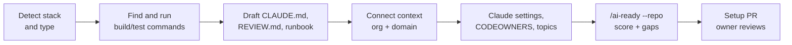
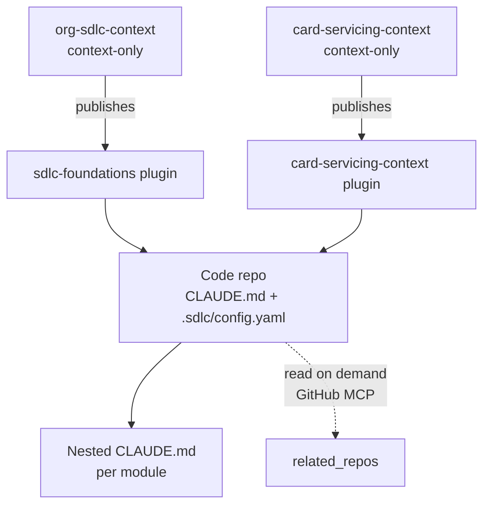
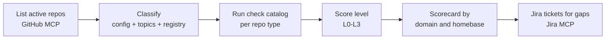

# AI-Native SDLC Phase 1: Repo and Context Readiness

Draft · 2026-09-17 · Shared version: https://claude.ai/code/artifact/197303cf-17c9-4d95-be92-f4db5b3ff492

**Summary.** No SDLC skill should run in a repo until that repo is **AI ready**. AI ready means four things:

1. The repo declares what it is and who owns it.
2. An agent can build and test it without help.
3. Its context is connected to the right org and domain layers.
4. A scanner can prove all of this from outside the repo.

Phase 1 adds two prerequisite pieces ahead of the Foundations plugin:

- **`/repo-ready`** sets up a repo.
- **`/ai-ready`** scores one repo in depth, or every repo in the org at a lighter depth.

Every repo declares a `repo_type`, and each type has its own checks. Special types such as `context-only` or `exempt` must be registered centrally, so they can't be used to avoid the requirements.

This extends [Phase 1: Foundations](02-phase-1-foundations.md). It assumes the GitHub and Jira MCP servers are available in Claude.

## 1. Repo types and readiness levels

Every repo gets one type and one level. The type decides which checks apply, and the level says how far the repo has progressed.

**1.1 Repo types** (declared as `repo_type` in `.sdlc/config.yaml`)

| Type | What it is | Needs build/test commands | Needs the SDLC contract | Registration required |
| --- | --- | --- | --- | --- |
| `service` | Deployable application or API | Yes | Yes | No |
| `library` | Shared package or SDK | Yes | Yes | No |
| `infra` | Infrastructure-as-code, pipelines, platform config | Yes (plan/validate) | Yes | No |
| `data` | Data pipelines, models, analytics code | Yes | Yes | No |
| `monorepo` | Several of the above in one repo; each package declares its own type | Per package | Yes | No |
| `context-only` | Org or domain context: policies, skills, templates, glossaries, service catalog. No production code. | Evals only | No, but versioning and ownership rules apply | **Yes** |
| `docs` | Documentation or design assets with no code | No | No | **Yes** |
| `sample` | Templates, examples, spikes that are never deployed | Optional | No | **Yes** |
| `exempt` | Vendored or third-party mirrors, or other justified cases | No | No | **Yes, with reason, approver and expiry** |
| *(archived)* | GitHub's archived flag | — | — | Excluded automatically |

Registration means a PR to `registry/repos.yaml` in the org context repo, approved by your team. A repo that declares a registered type without being listed is reported as "unverified type" and scored as `service` (section 4.4).

**1.2 Readiness levels**

| Level | Name | Meaning | Unlocks |
| --- | --- | --- | --- |
| L0 | Unknown | No `.sdlc/config.yaml` | Nothing; skills offer to run `/repo-ready` |
| L1 | Declared | Type, owners, homebase and domain declared; CODEOWNERS covers context and config | `/ai-ready`, `/explain-service` in read-only form |
| L2 | Agent-ready | Context layers connected; `CLAUDE.md` passes the checks; build and test commands verified; Claude project settings in place | Authoring skills (`/intent`, `/spec`, `/plan`), run-the-engine skills |
| L3 | SDLC-ready | Artifact contract, git hooks, PR template, approvals and CODEOWNERS for artifacts all in place | `/pr-prepare`, blocking hooks, `/pod-handoff` |
| L4 | Enforced (Phase 2) | Required GitHub check and managed hooks active | Headless agents |

For `context-only` repos, the levels mean different things. L2 requires an index, owners, a changelog, evals and a published plugin. L3 requires that the evals pass on the latest release.

## 2. Setting up a repo

A code repo reaches L2 with one setup PR produced by `/repo-ready` and reviewed by the repo owner, and L3 with a second PR from `/sdlc-init`. With Claude doing the drafting, expect about 1–2 hours of owner time per repo; most of it goes into checking the generated `CLAUDE.md`.

**2.1 The AI-ready baseline, file by file**

| Area | File or setting | What it must contain | Level |
| --- | --- | --- | --- |
| Identity | `.sdlc/config.yaml` | `repo_type`, `homebase`, `domain`, `jira_projects`, `data_classification`, `context` block (2.2) | L1 |
| Ownership | `CODEOWNERS` | Owners for `CLAUDE.md`, `REVIEW.md`, `.sdlc/`, `.claude/`, `.githooks/` and (L3) artifact paths | L1 |
| Discoverability | GitHub topics | `ai-sdlc` plus `sdlc-type-<type>`, used by the org scanner as a cross-check | L1 |
| Commands | `CLAUDE.md` "Commands" section, ideally backed by scripts such as `scripts/setup`, `scripts/test`, `scripts/lint` | Non-interactive setup, build, unit test, lint and format commands. They must run without production secrets (use `.env.example` and local stubs), and there must be a fast test subset under ~5 minutes. | L2 |
| Verified commands | `.sdlc/verify.json` (written by `/repo-ready --verify`) | Commit, date and pass/fail for each command. This is how the org scanner knows the commands work without running them. | L2 |
| Repo context | `CLAUDE.md` | Required sections (section 3.4), under ~150 lines, owners and `last_reviewed` date | L2 |
| Review policy | `REVIEW.md` | Severity definitions, what to flag, what to skip, repo-specific risks | L2 |
| Decisions and design | `docs/adr/`, `docs/architecture.md` | At least an architecture overview; ADRs from now on | L2 |
| Operations (`service`, `infra`) | `docs/runbook.md` | Alerts, dashboards, common failures, rollback | L2 |
| Claude project settings | `.claude/settings.json` | Allow rules for the repo's build and test commands; deny rules for reading secrets (`.env`, `*.pem`, `**/secrets/**`); required plugins listed (if managed settings allow it) | L2 |
| Local-only files | `.gitignore` | `CLAUDE.local.md`, `.claude/settings.local.json`, local worktree folders | L2 |
| SDLC contract | `.sdlc/config.yaml` (adapter, `artifact_root`, `risk_paths`, `approvals`), PR template, `.githooks/`, vendored `sdlc-check` | As defined in the Phase 1 doc | L3 |
| Artifact ownership | `CODEOWNERS` | Product for intents and requirements, Design for `ux.md`, tech lead for specs | L3 |

**2.2 The `.sdlc/config.yaml` identity and context block**

```yaml
version: 1
repo_type: service
homebase: card-servicing-core
domain: card-servicing
jira_projects: [CARD]
data_classification: restricted       # public | internal | confidential | restricted
owners: ["@org/card-servicing-core"]
context:
  org: sdlc-foundations@^1.2          # org context plugin + version range
  domain: card-servicing-context@^0.4 # domain context plugin
  service_id: card-transactions-api   # entry in the domain service catalog
  related_repos:                       # read on demand through GitHub MCP, never copied
    - org/card-api-contracts
    - org/card-web
commands:
  setup: scripts/setup
  build: scripts/build
  test_fast: scripts/test --fast
  test: scripts/test
  lint: scripts/lint
```

`data_classification` sets the defaults: restricted repos start one tier higher for risk paths and always load the data-handling policy skill.

**2.3 The `/repo-ready` flow**



1. **Detect.** Reads build files, languages and deploy config, then proposes a `repo_type`. If it proposes a type that needs registration, it opens the registry PR too.
2. **Commands.** Finds the existing build and test commands, runs them, and fixes or wraps them in `scripts/` when they are interactive or need secrets. Writes `.sdlc/verify.json`. If tests fail on the default branch, it stops and reports; a repo with failing tests can't be L2.
3. **Context.** Starts from Claude Code's `/init` output, reshapes it into the org `CLAUDE.md` template, and fills architecture and pitfalls from code, ADRs and recent PR history (read through GitHub MCP). Looks up the service in the domain catalog.
4. **Connect.** Writes the `context` block and confirms the named plugins exist in the marketplace.
5. **Settings and ownership.** Writes `.claude/settings.json`, updates `CODEOWNERS` and sets topics.
6. **Score.** Runs `/ai-ready --repo` and puts the scorecard in the PR description, so the reviewer can see what's left.

**Monorepos.** `/repo-ready` runs per package. Each package gets a nested `CLAUDE.md` and its own `commands` entry under `packages:` in the config. The root `CLAUDE.md` is only a map of the packages.

## 3. Setting up multi-level context

Context is layered: one org context repo, one context repo per domain, and files inside each code repo. The two kinds of context repo are `context-only` repos that publish plugins. Code repos declare which ones they inherit from, and never copy their contents.



**3.1 Org context repo** (`org-sdlc-context`, owned by your team)

```text
org-sdlc-context/
  .sdlc/config.yaml           # repo_type: context-only
  CONTEXT.md                  # index: what's here, owners, how to propose changes
  CHANGELOG.md                # semver; MUST-level changes called out
  core/org-core.md            # <=50 lines, loaded every session (non-negotiables)
  policies/                   # one folder per policy skill
    secure-coding/SKILL.md
    data-classification/SKILL.md
    logging-and-audit/SKILL.md
    api-standards/SKILL.md
    design-system/SKILL.md
  contract/                   # artifact contract, tiers, trailer spec, JSON schemas
  templates/                  # intent, requirements, ux, spec, hld, lld, plan, CLAUDE.md, REVIEW.md
  architecture/               # principles, reference architectures
  glossary.md
  registry/repos.yaml         # registered context-only, docs, sample, exempt repos
  registry/domains.yaml       # domain -> domain context repo, homebases, owners
  evals/                      # test prompts and expected behavior per skill
  build/                      # packages everything into the sdlc-foundations plugin
```

**3.2 Domain context repo** (`<domain>-context`, owned by the domain's homebase leads)

```text
card-servicing-context/
  .sdlc/config.yaml           # repo_type: context-only, domain: card-servicing
  CONTEXT.md  CHANGELOG.md
  core/domain-core.md         # <=30 lines, optional, loaded every session in this domain
  service-catalog.yaml        # service_id -> repo, homebase, on-call, runbook, dependencies
  glossary.md                 # domain terms (e.g. dispute, chargeback, provisional credit)
  integration-map.md          # upstream/downstream systems and contracts
  skills/                     # domain skills: explain-service, triage, runbook-step, domain policies
  templates/                  # optional overrides of org templates (required sections still apply)
  evals/
  build/                      # packages into the card-servicing-context plugin
```

`service-catalog.yaml` is what lets `/explain-service` and `/triage` find the right repo, owner and runbook, even for a homebase engineer who has never seen the service.

**3.3 How the layers load and resolve conflicts**

| Layer | Always loaded | Loaded when relevant | Size budget | Owner | Review cadence |
| --- | --- | --- | --- | --- | --- |
| Org | `org-core.md` via `SessionStart` hook | Policy skills | 50 lines | Your team | Quarterly, and on every release |
| Domain | `domain-core.md` (optional) via `SessionStart` hook | Domain skills, catalog lookups | 30 lines | Homebase leads | Quarterly |
| Repo | `CLAUDE.md` | `REVIEW.md`, ADRs, runbook, artifacts (by pointer) | 150 lines | Repo CODEOWNERS | Whenever a PR makes it wrong; at least every 180 days |
| Directory | Nested `CLAUDE.md` when working in that directory | — | 50 lines each | Module owner | With the module |
| Personal | `~/.claude/CLAUDE.md` or a local gitignored file | — | Personal | Engineer | — |

Rules:

- **Org MUST rules always win.** They are also enforced by checks, not just stated in text.
- **For conventions, the more specific layer wins:** directory over repo, repo over domain.
- **Contradictions are reported.** `/context-audit` flags any lower layer that contradicts an org MUST rule.
- **Related repos are read, never copied.** Skills read them through GitHub MCP when needed, such as an API contract in `related_repos`. Copies go stale.

**3.4 Required `CLAUDE.md` sections for code repos**

1. Purpose and domain: one paragraph, plus the `service_id`
2. Architecture map: main components and where they live
3. Commands: matching `.sdlc/config.yaml`
4. Conventions: only what differs from org and domain standards
5. Testing: where tests live, fixtures, how to run a single test
6. Known pitfalls
7. SDLC: where artifacts live, local risk paths, approval mode
8. Pointers: ADRs, runbook, dashboards, related repos
9. Frontmatter or a footer with owners and `last_reviewed`

**3.5 Versioning and quality of context**

- **Semver releases.** Context plugins use semver. A new MUST rule is a minor release with a changelog entry and an announcement. Removing or weakening a rule needs the owning team's approval.
- **Version ranges.** Code repos pin a range (`^1.2`). The `SessionStart` hook warns when an installed plugin is outside the range or when a newer minor version exists.
- **Evals before release.** Each skill in a context repo has a small eval set: prompts, expected behavior and red-flag behaviors. `/context-eval` runs them locally before each release and records the results in `CHANGELOG.md`. Phase 2 moves this into CI.
- **Health checks.** `/context-audit` works on every layer, checking size budgets, dead links, stale `last_reviewed` dates, contradictions and secret or PII patterns.

## 4. Verifying the org is AI ready

`/ai-ready` has two modes that share one check catalog. `--repo` runs locally and in depth, including executing commands. `--org` runs from your team's machine through the GitHub MCP server, reading files and metadata in every repo without cloning. Remote mode trusts evidence files such as `verify.json` only when they are recent and tied to a recent commit.



**4.1 Scope.** Scan non-archived, non-fork repos that were pushed to in the last 180 days. Report older repos separately as "dormant", so they don't lower anyone's score but also aren't silently counted as ready.

**4.2 Check catalog** (the same catalog in both modes; "Remote" says how org mode checks it)

| ID | Check | Applies to | Remote | Level |
| --- | --- | --- | --- | --- |
| ID-1 | `.sdlc/config.yaml` exists and matches the schema | All | Read file | L1 |
| ID-2 | `repo_type` is valid, matches the `sdlc-type-*` topic, and is registered if the type requires it | All | File, topics, registry | L1 |
| ID-3 | `homebase` and `domain` exist in `registry/domains.yaml`; `service_id` exists in that domain's catalog | Code types | Registry and catalog | L1 |
| ID-4 | `CODEOWNERS` covers `CLAUDE.md`, `.sdlc/`, `.claude/`, `.githooks/` | All except exempt | Read file | L1 |
| CX-1 | `CLAUDE.md` exists with the required sections and within its size budget | Code types | Read file | L2 |
| CX-2 | `CLAUDE.md` `last_reviewed` within 180 days, or updated since the last 50 commits | Code types | File and commits | L2 |
| CX-3 | Declared org and domain plugins exist in the marketplace, and the version ranges resolve | Code types | Marketplace repo | L2 |
| CX-4 | `REVIEW.md` exists; `docs/architecture.md` exists; runbook exists for `service`/`infra` | Code types | Read files | L2 |
| CX-5 | No contradiction with org MUST rules | Code types | **Local only** (runs an LLM check) | L2 advisory |
| BT-1 | Commands declared for setup, build, fast test, test and lint | Code types | Read file | L2 |
| BT-2 | `verify.json` shows all commands passing, is under 30 days old, and names a commit within the last 50 commits on the default branch | Code types | Read file and commits | L2 |
| ST-1 | `.claude/settings.json` has deny rules for secret paths and lists the Foundations plugin | Code types | Read file | L2 |
| SD-1 | PR template contains the trailer block | Code types | Read file | L3 |
| SD-2 | `.githooks/` present; vendored `sdlc-check` is at or above the minimum version | Code types | Read files | L3 |
| SD-3 | Adapter set, artifact paths resolve, `approvals` mode set, CODEOWNERS for artifact paths | Code types | Read files | L3 |
| SD-4 | At least 80% of Tier 2+ PRs merged in the last 30 days have trailers and approval evidence | Code types | PRs via GitHub MCP | L3 (behavior) |
| CO-1 | `CONTEXT.md`, `CHANGELOG.md`, owners, `evals/` present | context-only | Read files | L2 |
| CO-2 | Latest release tag matches the published plugin version; evals recorded for that release | context-only | Tags, marketplace, changelog | L3 |
| EX-1 | Registry entry has reason, approver and an expiry date in the future | exempt, docs, sample | Registry | L1 |

**4.3 Scoring.** A repo's level is the highest level at which **all** applicable checks pass. Failed checks are listed with the command that fixes them, usually `/repo-ready --fix <check-id>`. Advisory checks never lower the level.

**4.4 Preventing misuse of `context-only` and other special types**

Marking a repo `context-only`, `docs`, `sample` or `exempt` turns off most checks, so the scanner doesn't take the label on trust.

1. **Registration.** The type must be listed in `registry/repos.yaml`, added by a PR your team approves. The entry includes the owner, a purpose, and for `exempt` a reason and an expiry date. An unregistered special type is scored as `service` and flagged "unverified type".
2. **Content check.** Context-only and docs repos must not look like applications. The scanner flags a repo that has:
    - build or deploy files (for example a Dockerfile, Helm charts, Terraform, or a `package.json` with a start script)
    - source code beyond scripts and eval harnesses
    - GitHub releases or deployments
    - recent commits under `src/`
3. **Usage check.** A context-only repo must publish a plugin that is actually listed in the marketplace. A context repo nobody uses is flagged as "orphaned".
4. **Expiry.** Exemptions expire, 6 months at most. Expired ones show as failures until renewed.
5. **Change alerts.** The scanner lists every repo whose `repo_type` changed since the last scan, so type changes are reviewed rather than silent.

**4.5 Outputs**

- **Scorecard:** a markdown and CSV report per domain and homebase, showing the count of repos at each level, the top failing checks, and the trend since the last scan.
- **Tickets:** one Jira ticket per homebase (not per repo) with the list of gaps, created and updated through the Jira MCP server. This keeps the noise down across hundreds of repos.
- **Badge:** optionally, `/repo-ready` adds an "AI readiness: L2" line to the README with the scan date, so the state is visible where engineers look.

Example scorecard row:

| Domain | Homebase | Active repos | L0 | L1 | L2 | L3 | Special (registered) | Top gap |
| --- | --- | --- | --- | --- | --- | --- | --- | --- |
| card-servicing | card-servicing-core | 42 | 6 | 9 | 18 | 7 | 2 | BT-2: commands not verified in last 30 days |

**4.6 Running it at scale.** Scan in batches through GitHub MCP and cache results by repo and commit, so unchanged repos are skipped. Run weekly. Phase 2 moves the scan to a scheduled headless job with a service identity, and moves `BT-2` evidence to CI runs instead of local stamps.

## 5. How plugins depend on readiness

Each SDLC skill starts with a quick readiness check that reads files only and finishes in under a second. If the repo is below the level the skill needs, the skill doesn't fail silently. It explains what is missing and offers to run `/repo-ready`.

| Minimum level | Skills and hooks | Why this level |
| --- | --- | --- |
| None | `/repo-ready`, `/ai-ready` | These create readiness |
| L1 | `/context-audit`, read-only `/explain-service` | Needs ownership and domain to find context |
| L2 | `/intent`, `/ux-spec`, `/spec`, `/design-doc`, `/plan`, `/self-review`, `/prototype`, `/triage`, `/runbook-step`, `/dependency-upgrade`, `/intent-from-incident` | Needs context and working build/test commands, or agent output can't be trusted |
| L3 | `/sdlc-init` completion, `/pr-prepare`, `/amend`, `/change-impact`, `/pod-handoff`, blocking Claude hooks and git hooks | Needs the artifact contract and approvals configured |

The `SessionStart` hook prints the repo's level and its top gap in one line, for example: `AI readiness: L2 (missing: SD-2 git hooks) - run /sdlc-init`. Engineers see it every session without having to go looking.

Pods starting new work may only work in repos at **L3 or above**. A pod that inherits a repo below L3 must bring it up to L3 in its first sprint. This keeps readiness debt from building up in homebases.

## 6. Rollout sequence and changes to the Phase 1 plan

Readiness becomes Stage 0 of the Phase 1 rollout. The Foundations skills ship only after the context layer and the scanner exist.

| Step | Work | Owner | Done when |
| --- | --- | --- | --- |
| 0a | Create `org-sdlc-context`: core, contract, templates, registries, first policy skills, evals, build into the plugin | Your team | Plugin v0.1 is in the marketplace |
| 0b | Build `/repo-ready` and `/ai-ready` (repo and org modes) | Your team | Both run end to end on 2 internal repos |
| 0c | **Baseline scan** of the whole org with `/ai-ready --org` | Your team | First scorecard: how many repos are L0 to L3, by domain |
| 0d | Create a domain context repo for each pilot domain, including its service catalog | Pilot homebase leads | Domain plugin v0.1 published; pilot services in the catalog |
| 0e | Bring pilot repos to L2 with `/repo-ready`, then L3 with `/sdlc-init` | Pilot teams | All pilot repos at L3 |
| 1+ | Phase 1 pilot, expansion and scale (as in the Phase 1 doc), with the weekly scan tracking readiness | All | Readiness targets per domain met |

**Suggested org targets** (to calibrate after the baseline scan): every active repo at L1 early on, since it takes minutes; repos with active pods at L3; other homebase repos at L2 before any pod work touches them.

**Changes to the Phase 1 doc**

- `/sdlc-init` is split in two: `/repo-ready` handles the prerequisites (L1–L2) and `/sdlc-init` handles the contract (L3).
- New skills: `/ai-ready`, `/context-eval` and `/repo-ready --fix <check-id>`.
- `.sdlc/config.yaml` gains the identity, `context` and `commands` blocks.
- The org context repo gains `registry/repos.yaml` and `registry/domains.yaml`.
- Adoption metrics now use readiness levels from the scanner instead of a simple "plugin installed" count.

## 7. Open questions to verify

- [ ] **Repo count and shape.** How many active repos are there, and how many are monorepos? This sets the batch size for the scan and how much work `/repo-ready` has per package.
- [ ] **Project-level plugin settings.** Do managed settings let a repo's `.claude/settings.json` list required plugins and marketplaces, and set allow and deny rules? If not, those move into managed settings (Phase 2), and ST-1 checks only the deny rules.
- [ ] **GitHub MCP limits.** Does the GitHub MCP server support org-wide code search, listing repos with topics, reading tags and releases, and reasonable rate limits for scanning hundreds of repos?
- [ ] **Topics and custom properties.** Can repo admins set topics? Would GitHub org admins define a repository custom property for `repo_type`? Custom properties are sturdier than topics, but only org admins can create them.
- [ ] **Existing catalogs.** Is there already an internal service catalog or developer portal? If so, `service-catalog.yaml` should reference it or be generated from it, not duplicate it.
- [ ] **Where `verify.json` comes from.** Is a local stamp acceptable evidence for Phase 1, or does Risk require CI-produced evidence? That would make BT-2 a Phase 2 check.
- [ ] **Domain ownership.** Who owns each domain context repo when a domain has several homebases? One lead, or a rotation?
